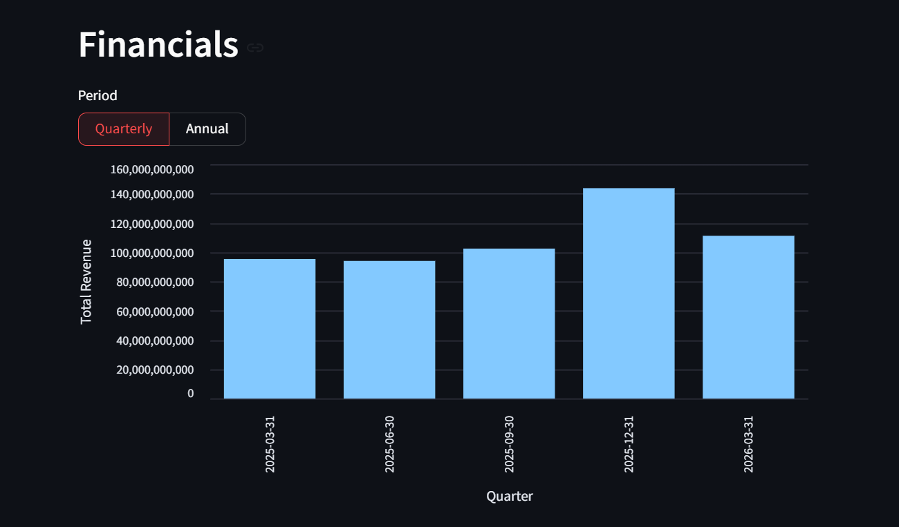

# Stock Analysis Dashboard

An interactive stock market dashboard built using Python, Streamlit, Plotly, Altair, and yfinance.

## Features

- Search stocks using ticker symbols
- Interactive candlestick stock charts
- Weekly stock price visualization
- Quarterly financial analysis
- Annual financial analysis
- Real-time financial data using Yahoo Finance
- Interactive charts and visualizations

---

## Tech Stack

- Python
- Streamlit
- pandas
- yfinance
- Plotly
- Altair

---

## Screenshots

### Dashboard Overview


### Candlestick Chart


### Financial Analysis



## Project Structure

```text
stock-analysis-dashboard/
│
├── stock_dashboard.py
├── requirements.txt
├── .gitignore
├── README.md
└── screenshots/
